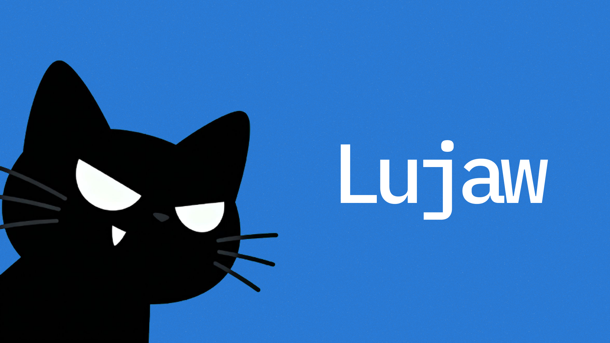

[Landing](https://lujaw.vercel.app) · [Demo video](https://youtu.be/vcTYoqwRHRI) · [Demo script](docs/binance-cursor-demo.md) · [Demo prompts](prompts.md)

## Problem

Binance Agent OS gives AI agents real Spot trading power. Without hard bounds,
a hostile or confused prompt can propose an all-in buy, mutate an approved size,
or skip verification — and the host can still call Binance MCP directly.

A trading agent needs a seatbelt that stays on when the model goes stupid: durable
policy, deterministic sizing, exact-hash authorization, and post-trade evidence.

## Solution

**LUJAW is the seatbelt for AI Spot trades: durable policy, deterministic size,
exact-hash auth, episode verify.**

Binance Agent OS gives agents financial capabilities. LUJAW bounds Spot orders
before they hit Binance — then verifies what actually filled.

Set caps once. LUJAW preflights size, binds one authorized order, and verifies
the fill after Binance confirms. The MCP host (Codex / Cursor) orchestrates LUJAW
MCP and Binance MCP; LUJAW never stores Binance OAuth tokens and does not place
the trade itself.

Does not promise profit. Designed as a workflow seatbelt — not a hard cage around every possible host call.

### What's proven

The seatbelt path judges care about is live today:

| Proof | Result | Link |
| ----- | ------ | ---- |
| Live empty Agentic account + hostile all-in | `BLOCK` · `MIN_RESERVE_BINDING` · no trade tools | [Codex demo](docs/binance-cursor-demo.md) · [`prompts.md`](prompts.md) |
| Same engine, labeled 20-USDT simulation | `ALLOW` for exact 10-USDT `BNBUSDT` buy; stops before authorize | `pnpm demo:no-funds` |
| Deterministic fixtures / episode shape | [`deployments/evidence/binance-spot-demo.redacted.json`](deployments/evidence/binance-spot-demo.redacted.json) | — |

Runbook: [`docs/binance-no-funds-demo.md`](docs/binance-no-funds-demo.md).

---

## Deployments

| Resource | Value |
| -------- | ----- |
| Landing / marketing | [https://lujaw.vercel.app](https://lujaw.vercel.app) |
| Demo video | [https://youtu.be/vcTYoqwRHRI](https://youtu.be/vcTYoqwRHRI) |
| Demo prompts | [`prompts.md`](prompts.md) |
| npm MCP (`lujaw-mcp`) | [`@lujaw-binance/agent`](https://www.npmjs.com/package/@lujaw-binance/agent) |
| npm core engine | [`@lujaw-binance/core`](https://www.npmjs.com/package/@lujaw-binance/core) |
| Primary venue | Binance Spot · Agentic sub-account · USDT · `BNBUSDT` demo allowlist |
| Spot fixtures | [`fixtures/binance-mcp/`](fixtures/binance-mcp/) |
| Evidence | [`deployments/evidence/`](deployments/evidence/) |

Demo guides: [`docs/binance-cursor-demo.md`](docs/binance-cursor-demo.md) ·
[`docs/binance-no-funds-demo.md`](docs/binance-no-funds-demo.md) ·
[`docs/binance-live-gate.md`](docs/binance-live-gate.md) ·
[`docs/binance-threat-model.md`](docs/binance-threat-model.md)

---

## Workspace

| Package / app | Purpose |
| ------------- | ------- |
| [`apps/agent`](apps/agent) | LUJAW CLI + stdio MCP — Spot seatbelt tools |
| [`packages/core`](packages/core) | Deterministic Spot policy / preflight / auth / episode |
| [`apps/web`](apps/web) | Marketing landing ([lujaw.vercel.app](https://lujaw.vercel.app)) |
| [`skills/lujaw`](skills/lujaw) | Host skill for Spot-first tool routing |
| [`fixtures/binance-mcp`](fixtures/binance-mcp) | Redacted / synthetic Spot MCP-shaped fixtures |
| [`deployments`](deployments) | Evidence artifacts |

---

## Core Architecture

```text
MCP host (Codex / Cursor)
  ├── Binance Agent OS MCP
  │     market data · balances · confirmed Spot execution
  └── LUJAW MCP (@lujaw-binance/agent)
        policy + exact-hash accept
        deterministic preflight (ALLOW / REDUCE / BLOCK)
        one-shot authorization (does not place the order)
        episode verify (host evidence, non-attested)
```

```text
apps/agent (MCP + CLI)
  ↓
@lujaw-binance/core     decimal · filters · book · valuation · preflight · episode
  ↓
.host-supplied observations / fixtures
  ↓
.lujaw/binance/         active policy · authorizations · daily ledger · episodes
```

```text
lujaw-binance/
├── apps/
│   ├── agent/           CLI + MCP server
│   └── web/             marketing landing
├── packages/
│   └── core/            Spot deterministic engine
├── fixtures/binance-mcp/
├── deployments/         evidence
├── skills/lujaw/
├── docs/                demo, threat model, live gate
├── prompts.md           copy-paste Codex demo prompts
└── .cursor/             mcp.json + safety rule
```

**Integrity vs authenticity:** episode hashes detect tampering after creation.
Host-supplied Binance fields are treated as host evidence, not exchange
attestations — by design for the MCP sibling-tool model.

---

## Spot Safety Workflow

1. **Set policy** — `lujaw_policy_create`. Caps, reserve, budget, allowlist. Accept the exact `policyHash`.
2. **Observe Spot** — Binance MCP read. Pull balances, ticker, and book for the proposed symbol.
3. **Preflight** — `lujaw_order_preflight`. Deterministic `ALLOW` / `REDUCE` / `BLOCK`. Hostile all-in dies here.
4. **Authorize** — `lujaw_order_authorize`. One-shot hash on the exact normalized order. Does **not** place it.
5. **Confirm & trade** — Binance MCP write. Show the authorized order. Binance runs its own user confirmation.
6. **Verify episode** — `lujaw_episode_verify`. Check redacted fill + balances into a canonical episode.

Primary MCP tools:

| Tool | Purpose |
| ---- | ------- |
| `lujaw_policy_create` | Draft or activate a hashed Spot policy |
| `lujaw_order_preflight` | Deterministic sizing / risk checks |
| `lujaw_order_authorize` | One-shot authorization; does not place the order |
| `lujaw_episode_verify` | Verify redacted fill + balances into an episode |

---

## Key Features

Seatbelt for AI Spot trades — every feature maps to bound → authorize → verify:

- **Durable Spot policy** — USDT-quoted allowlist, reserve, concentration, daily budget, slippage, fee buffer
- **Deterministic preflight** — exact decimal math; `ALLOW` / `REDUCE` / `BLOCK` / `INCONCLUSIVE`; no float money math
- **Hostile all-in dies early** — oversized prompts reduce or block before any Binance trade tool
- **Exact-hash acceptance** — policy and preflight bind by displayed hash
- **One-shot authorization** — short TTL, nonce, atomic daily reservation; LUJAW does not execute
- **Episode evidence** — canonical, tamper-evident after creation; host evidence labeled non-attested
- **Fixture-backed CI** — reproducible Spot fixtures; `pnpm demo:no-funds` for the positive preflight path
- **Public MCP install** — `npx -y @lujaw-binance/agent lujaw-mcp`

---

## Tech Stack

| Layer | Stack |
| ----- | ----- |
| MCP / CLI | Node.js ≥20.12, TypeScript, `@modelcontextprotocol/sdk`, Zod |
| Core engine | Exact decimal bigint math, viem keccak canonical hashing |
| Host | Codex CLI + official Binance Agent OS MCP (remote OAuth); LUJAW as MCP safety layer |
| Marketing | Next.js (`apps/web`) → [lujaw.vercel.app](https://lujaw.vercel.app) |
| Packaging | pnpm workspace · npm `@lujaw-binance/*` |

---

## Local Development

**Prerequisites:** Node.js `>=20.12` · pnpm `9.15.0`

| Command | Description |
| ------- | ----------- |
| `pnpm install --frozen-lockfile` | Install workspace deps |
| `pnpm test` | Core + agent tests (fixtures only; no Binance auth) |
| `pnpm typecheck` | Typecheck all packages |
| `pnpm build` | Build workspace |
| `pnpm build:mcp` | Build `@lujaw-binance/core` + `@lujaw-binance/agent` for MCP stdio hosts |
| `pnpm demo:no-funds` | Positive simulated 10-USDT preflight (`ALLOW`); stops before authorize |
| `pnpm mcp` | Run LUJAW MCP via tsx |

Copy [`.env.example`](.env.example) to `.env` only if you need local overrides. Spot
seatbelt tools need no Binance secrets in LUJAW — connect Binance MCP in Codex
(recording host) or another MCP host separately.

### MCP config

Local (clone):

```json
"lujaw": {
  "command": "node",
  "args": ["${workspaceFolder}/apps/agent/dist/mcp.js"]
}
```

Public (npm):

```json
"lujaw": {
  "command": "npx",
  "args": ["-y", "@lujaw-binance/agent", "lujaw-mcp"]
}
```

Plus official Binance Agent OS MCP via Binance’s documented OAuth flow.
Workflow rule: [`.cursor/rules/lujaw-binance-safety.mdc`](.cursor/rules/lujaw-binance-safety.mdc).
Recording prompts: [`prompts.md`](prompts.md).

---

## Trust & Security

What this build is built to do well:

- **Policy before power** — durable Spot caps bind before any authorize step.
- **Fail closed** — stale or incomplete observations never `ALLOW`.
- **Hash binding** — mutate policy / preflight / order fields and acceptance breaks.
- **No Binance secrets in LUJAW** — OAuth stays with Binance / the MCP host; LUJAW keeps local policy, auth, and episodes.
- **Honest scope** — LUJAW is the guided seatbelt layer; Binance still owns confirmation and execution. Details: [`docs/binance-threat-model.md`](docs/binance-threat-model.md).

### What you can claim from this demo

- LUJAW deterministically bounds AI-proposed Binance Spot trades in the guided workflow.
- Hostile all-in on an empty Agentic account dies at preflight (`BLOCK` / `MIN_RESERVE_BINDING`) with no trade tool.
- The same engine returns an exact compliant size on a labeled simulation (`pnpm demo:no-funds`).
- Episodes are canonical and tamper-evident after creation.

### Keep claims tight

- Don’t pitch LUJAW as non-bypassable when the host can call Binance MCP directly.
- Don’t claim cryptographic attestation of Binance MCP responses.
- Don’t promise fill price, profit, or “safe trading.”
- Demo surface is Spot / USDT / `BNBUSDT` — not Futures, Margin, or withdrawals.

---

## Roadmap

Spot seatbelt vertical slice is shipping. Next extensions stay in the same lane:

- **Stronger enforcement** — optional LUJAW-owned execution path so trade capability never sits raw on the agent.
- **Richer Spot surface** — sells, limits, cancel/replace as discovery allows.
- **Deeper live episodes** — redacted post-trade verify on intentional disposable balances.
- **Discovery refresh** — keep fixture names aligned with live Binance MCP `tools/list`.
